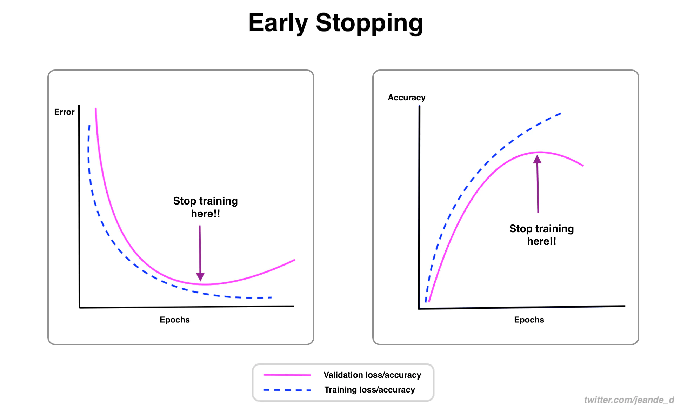

Early stopping is one of the effective and simplest regularization techniques used in training neural networks.

### The Idea Behind Early Stopping and Why you Should Always Use It

Usually, during training, the training loss will decrease gradually, and if everything goes well on the validation side, validation loss will decrease too. 

When the validation loss hits the local minimum point, it will start to increase again. Which is a signal of overfitting. 

How can we stop the training just right before the validation loss rise again? Or before the validation accuracy starts decreasing?

That's the motivation for early stopping. 

With early stopping, we can stop the training when there are no improvements in the validation metrics.

*Early stopping. Image by Author*

Another interesting thing about early stopping is that it can allow restoring the best model weights at the epoch/iteration where the validation loss was at the minimum point.

You should always consider using early stopping. 

Think about this...

When we specify the number of training epochs, we have no idea of the right number of epochs to train for. We don't know the specific epoch that will yield the lowest validation loss or highest accuracy.

Early stopping can help stop the training as soon as there are no improvements in validation metrics, which can ultimately save time and computation power. 

And thus, it is not merely for a better model generalization, but also for saving compute power and time.

Many notable deep learning leads have positive views about early stopping. Almost no one downvote using it. 

Geoffrey Hinton once said that early stopping is a "beautiful free lunch".

If you were training neural networks in early 2015, you would have to implement early stopping from scratch.

But today, most deep learning frameworks such as TensorFlow and PyTorch provide its implementation.

They also provide other related callback functions for controlling training. [Here](https://keras.io/api/callbacks/) is a link for early stopping and other callback functions in TensorFlow/Keras and [here](https://pytorch-lightning.readthedocs.io/en/latest/common/early_stopping.html) is for PyTorch. 

### The Downside of Early Stopping

There is only one downside of early stopping. You need to have validation data to use it. 

But in the grand scheme of things, that is not a downside because you still want to have validation data for evaluating your model during the training process either way.

This is the end of the article that was about early stopping, why it's a helpful technique, and why you should always use it.

As a punchline, early stopping helps stop the training when there is no improvement in validation loss/accuracy.

But there is one more thing:

You can get the practical implementation of early stopping, other ways to control training, and other machine learning and deep learning techniques from my [comprehensive machine learning repository](https://github.com/Nyandwi/machine_learning_complete)

*******

Thanks for reading!

Each week, with a probability of 80%, I write one article about machine learning techniques, ideas, or best practices.

If you found the article helpful, share it with anyone who you think would benefit from it, connect with me on  [Twitter](https://twitter.com/Jeande_d), or join my  [newsletter](https://www.getrevue.co/profile/deeprevision).