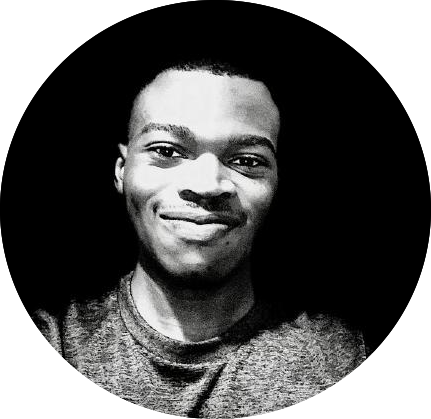

    
 

 

<!-- 

 -->

I'm Jean de Dieu Nyandwi. I am broadly interested in machine learning, deep learning, computer vision, and the intersection of vision and language.

Previously, I worked at VIEBEG Medical Ltd and instructed TensorFlow Deep Learning Certification course at The Python Academy.

I designed a [Complete Machine Learning Package](https://github.com/Nyandwi/machine_learning_complete) that contains over 32 end-to-end and interactive notebooks on various topics such as data analysis, data visualization, data cleaning, classical learning algorithms, and deep learning for visual recognition and natural language processing. The machine learning package has helped over 2000 people to learn and practice different machine learning concepts and techniques!

Other intensive learning materials I designed include revisions and implementations of [Modern Convolutional Neural Network Architectures](https://github.com/Nyandwi/ModernConvNets) and a [friendly introduction to Python tutorial](https://github.com/Nyandwi/PythonBasics)!

This site is a host of my [works](https://github.com/Nyandwi) and [writings](https://nyandwi.github.io/blog.html). You can find my old articles on [Medium](https://jeande.medium.com/) or [Hashnode](https://hashnode.com/). Occassionally, I create threads and share learning resources on [Twitter](https://twitter.com/jeande_d). I am also on [LinkedIn](https://www.linkedin.com/in/nyandwi/).

I am always happy to connect with new people. If you would like to collaborate, you can reach me at [johnjw7084@gmail.com](mailto:johnjw7084@gmail.com).

