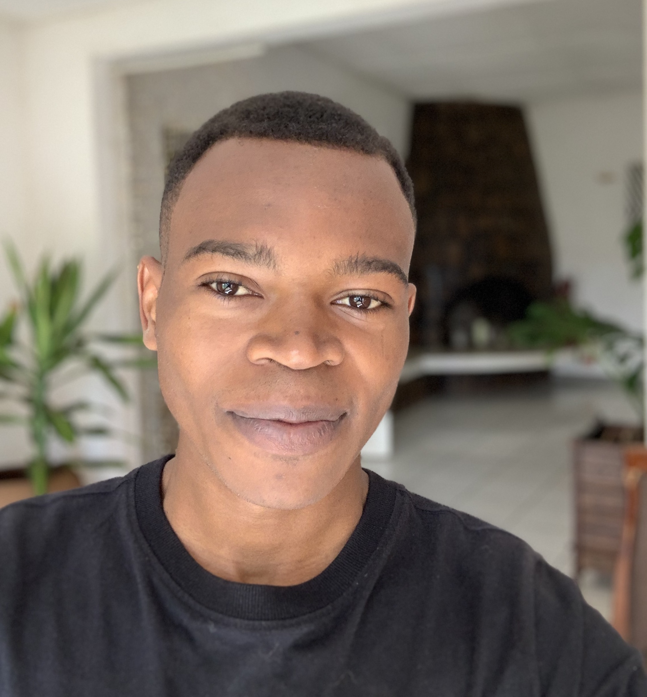

    

 

 <h1> Jean de Dieu Nyandwi </h1>
<a href="https://github.com/Nyandwi" target="_blank"> GitHub </a> | 
<a href="https://twitter.com/Jeande_d" target="_blank"> Twitter </a> |
<a href="https://www.linkedin.com/in/nyandwi/" target="_blank"> LinkedIn </a> |
<a href="mailto:johnjw7084@gmail.com" target="_blank"> Email </a>

**************************

I am an incoming graduate student at [Carnegie Mellon University Africa](https://www.africa.engineering.cmu.edu/index.html) in Engineering AI. My interests are machine learning, deep learning, and computer vision. I completed my undergraduate studies at University of Rwanda in Electronics and Telecommunication Engineering.

During college, I worked at startups, non-profit, and designed [machine learning educational materials](https://github.com/Nyandwi/machine_learning_complete).

**********************

 <h2> Latest News </h2> 

* Complete Machine Learning Package [is now available](https://twitter.com/Jeande_d/status/1525091467324035075?s=20&t=On0KI3EyJ8Z7PDkrevNv-A) on [web](https://nyandwi.com/machine_learning_complete/).

* I revamped the notebook [Transfer Learning with Pretrained ConvNets](https://github.com/Nyandwi/machine_learning_complete/blob/main/8_deep_computer_vision_with_tensorflow/3_transfer_learning_convnets.ipynb) in [Complete Machine Learning Package](https://github.com/Nyandwi/machine_learning_complete).

