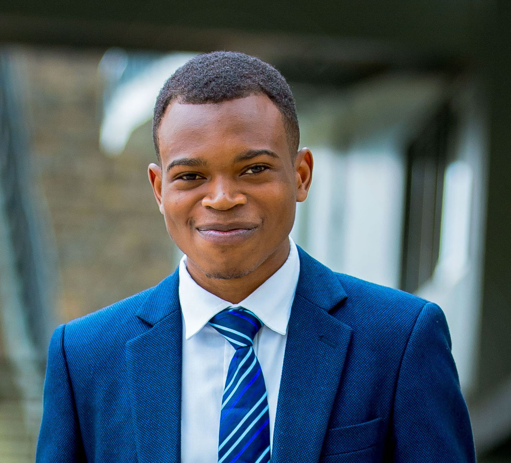

    

 

 <h1> Jean de Dieu Nyandwi </h1>
<a href="https://github.com/Nyandwi" target="_blank"> GitHub </a> | 
<a href="https://twitter.com/Jeande_d" target="_blank"> Twitter </a> |
<a href="https://www.linkedin.com/in/nyandwi/" target="_blank"> LinkedIn </a> |
<a href="mailto:johnjw7084@gmail.com" target="_blank"> Email </a>

**************************

I am a graduate student at Carnegie Mellon University in Master of Science in Engineering Artificial Intelligence. I am broadly interested in machine learning, deep learning, and computer vision. My research interests are visual representation learning, vision and language, and 3D vision.

I completed my undergraduate studies at University of Rwanda in Electronics and Telecommunication Engineering.

During college, I [learned](https://github.com/Nyandwi/nyandwi/tree/main/professional-certificates) machine learning(and mentored fellow learners along the way), worked at start-ups and non-profit.

**********************

 <h2> Teaching </h2> 

* Introduction to Deeep Learning - [[2022](https://github.com/Nyandwi/deep-learning-course-kigali)]
* Deep Learning with TensorFlow Certification [[2021](https://www.thepythonacademy.com/tensorflowcertification)]
* Complete Machine Learning Package [[2021](https://nyandwi.com/machine_learning_complete/)]

**********************

 <h2> Latest News </h2> 

* Oct 2022 - Appeared in [top 50 AI influencers](https://onalytica.com/blog/posts/whos-who-in-artificial-intelligence-top-50-influencers/) list made by Onalytica
* Sept 2022 - Nominated as one of the DeepLearning.AI Event Ambassador [Spotlight](https://www.deeplearning.ai/blog/pie-ai-ambassadors-2022/) 2022
* Aug 2022 - Started MS AI at Carnegie Mellon University Africa
* May 2022 - Complete Machine Learning Package [is now available](https://twitter.com/Jeande_d/status/1525091467324035075?s=20&t=On0KI3EyJ8Z7PDkrevNv-A) on [web](https://nyandwi.com/machine_learning_complete/)